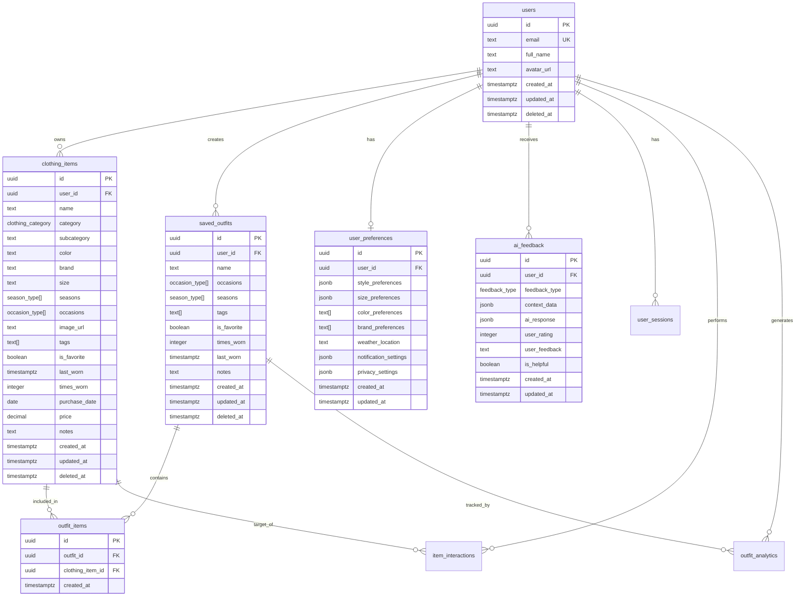

# Stylisto Database Schema Documentation

## Overview

The Stylisto database schema is designed to support a comprehensive wardrobe management application with AI-powered features. The schema implements proper data isolation through Row Level Security (RLS), maintains data integrity with foreign key constraints, and includes soft delete functionality for data preservation.

## Entity Relationship Diagram



## Table Descriptions

### Core Tables

#### users

- **Purpose**: Stores user account information
- **Key Features**:
  - References Supabase auth.users
  - Soft delete support
  - Email uniqueness constraint
- **RLS**: Users can only access their own data

#### clothing_items

- **Purpose**: Stores individual clothing items in user wardrobes
- **Key Features**:
  - Comprehensive item metadata (category, color, brand, etc.)
  - Array fields for seasons, occasions, and tags
  - Usage tracking (times_worn, last_worn)
  - Price tracking for wardrobe value calculation
  - Soft delete support
- **RLS**: Users can only access their own items

#### saved_outfits

- **Purpose**: Stores user-created outfit combinations
- **Key Features**:
  - Metadata for occasions and seasons
  - Usage tracking similar to clothing items
  - Soft delete support
- **RLS**: Users can only access their own outfits

#### outfit_items

- **Purpose**: Junction table linking outfits to clothing items
- **Key Features**:
  - Many-to-many relationship between outfits and items
  - Unique constraint prevents duplicate items in same outfit
- **RLS**: Access controlled through parent outfit ownership

### Supporting Tables

#### user_preferences

- **Purpose**: Stores user customization and settings
- **Key Features**:
  - JSONB fields for flexible preference storage
  - Notification and privacy settings
  - Weather location for outfit recommendations
- **RLS**: Users can only access their own preferences

#### ai_feedback

- **Purpose**: Tracks AI interactions and user feedback
- **Key Features**:
  - Categorized feedback types
  - JSONB storage for flexible context and response data
  - User rating system (1-5 scale)
- **RLS**: Users can only access their own feedback

### Analytics Tables

#### user_sessions

- **Purpose**: Tracks user app usage sessions
- **Key Features**:
  - Platform tracking (web, iOS, Android)
  - Session duration calculation
  - App version tracking

#### item_interactions

- **Purpose**: Tracks user interactions with clothing items
- **Key Features**:
  - Interaction type categorization
  - Flexible data storage with JSONB
  - Automatic times_worn updates

#### outfit_analytics

- **Purpose**: Tracks outfit usage and performance
- **Key Features**:
  - Event-based tracking
  - Weather data integration
  - Performance metrics

## Data Types and Enums

### Custom Enums

```sql
-- Clothing categories
CREATE TYPE clothing_category AS ENUM (
  'tops', 'bottoms', 'dresses', 'outerwear', 'shoes',
  'accessories', 'underwear', 'activewear', 'sleepwear', 'swimwear'
);

-- Seasons
CREATE TYPE season_type AS ENUM ('spring', 'summer', 'fall', 'winter');

-- Occasions
CREATE TYPE occasion_type AS ENUM (
  'casual', 'work', 'formal', 'party', 'sport', 'travel', 'date', 'special'
);

-- AI feedback types
CREATE TYPE feedback_type AS ENUM (
  'outfit_suggestion', 'style_recommendation', 'color_matching',
  'weather_outfit', 'occasion_outfit', 'item_categorization'
);
```

## Security Implementation

### Row Level Security (RLS)

All tables implement RLS policies ensuring:

- Users can only access their own data
- Proper authentication checks
- Cascade permissions for related data

### Example RLS Policy

```sql
CREATE POLICY "Users can read own clothing items"
  ON clothing_items
  FOR SELECT
  TO authenticated
  USING (auth.uid() = user_id AND deleted_at IS NULL);
```

### Data Integrity

#### Foreign Key Constraints

- All user-related tables reference `users(id)`
- Junction tables properly reference parent tables
- CASCADE deletes maintain referential integrity

#### Check Constraints

- `times_worn >= 0` ensures valid usage counts
- `price >= 0` ensures valid pricing
- `user_rating BETWEEN 1 AND 5` ensures valid ratings

#### Unique Constraints

- Email uniqueness in users table
- Unique outfit-item combinations in outfit_items

## Performance Optimization

### Indexing Strategy

#### Primary Indexes

- B-tree indexes on foreign keys and frequently queried columns
- Partial indexes excluding soft-deleted records
- Composite indexes for common query patterns

#### Specialized Indexes

- GIN indexes for array fields (seasons, occasions, tags)
- JSONB indexes for flexible data fields
- Descending indexes for time-based queries

### Example Indexes

```sql
-- Performance indexes
CREATE INDEX idx_clothing_items_user_id ON clothing_items(user_id) WHERE deleted_at IS NULL;
CREATE INDEX idx_clothing_items_seasons ON clothing_items USING GIN(seasons) WHERE deleted_at IS NULL;
CREATE INDEX idx_clothing_items_created_at ON clothing_items(created_at DESC) WHERE deleted_at IS NULL;
```

## Functions and Views

### Database Functions

#### Soft Delete Functions

- `soft_delete_clothing_item(uuid)`: Safely removes clothing items
- `soft_delete_outfit(uuid)`: Safely removes outfits

#### Analytics Functions

- `get_wardrobe_stats(uuid)`: Returns comprehensive wardrobe statistics
- `record_item_interaction(uuid, text, jsonb)`: Tracks user interactions

#### Usage Tracking

- Automatic `times_worn` updates
- `last_worn` timestamp management
- Interaction logging

### Database Views

#### user_wardrobe_summary

Provides aggregated wardrobe statistics per user:

- Total items and outfits
- Favorite counts
- Wardrobe value
- Usage metrics

#### popular_items

Ranks items by usage within each user's wardrobe:

- Popularity ranking
- Usage statistics
- Item details

#### outfit_recommendations

Aggregates outfit data for recommendation algorithms:

- Seasonal and occasion categorization
- Item composition analysis
- Usage patterns

## Soft Delete Implementation

### Strategy

- Uses `deleted_at` timestamp field
- Preserves data for analytics and recovery
- Filters deleted records in queries and policies

### Benefits

- Data recovery capability
- Historical analytics preservation
- Audit trail maintenance
- User experience improvement (undo functionality)

### Implementation

```sql
-- Soft delete example
UPDATE clothing_items
SET deleted_at = now(), updated_at = now()
WHERE id = item_id AND user_id = auth.uid();

-- Query filtering
SELECT * FROM clothing_items
WHERE user_id = auth.uid() AND deleted_at IS NULL;
```

## Migration Strategy

### File Organization

- Sequential numbered migrations
- Descriptive filenames
- Complete file content (no diffs)
- Comprehensive documentation

### Migration Safety

- IF NOT EXISTS clauses
- Conditional column additions
- Safe enum modifications
- Rollback considerations

## Testing Strategy

### Schema Validation Tests

1. **Table Creation**: Verify all tables exist with correct structure
2. **Constraint Validation**: Test all foreign keys and check constraints
3. **Index Performance**: Validate index usage in query plans
4. **Enum Integrity**: Test enum value constraints

### RLS Policy Tests

1. **Access Control**: Verify users can only access own data
2. **Cross-User Isolation**: Ensure no data leakage between users
3. **Authentication Requirements**: Test unauthenticated access denial
4. **Policy Coverage**: Verify all operations are properly secured

### Data Integrity Tests

1. **Foreign Key Enforcement**: Test cascade behaviors
2. **Unique Constraint Validation**: Test duplicate prevention
3. **Check Constraint Validation**: Test value range enforcement
4. **Soft Delete Behavior**: Test deletion and recovery workflows

### Performance Tests

1. **Query Performance**: Test common query patterns
2. **Index Utilization**: Verify index usage in execution plans
3. **Concurrent Access**: Test multi-user scenarios
4. **Large Dataset Performance**: Test with realistic data volumes

### Example Test Cases

```sql
-- Test RLS isolation
-- User A should not see User B's items
SELECT COUNT(*) FROM clothing_items; -- Should only return user's items

-- Test soft delete
SELECT soft_delete_clothing_item('item-uuid');
SELECT * FROM clothing_items WHERE id = 'item-uuid'; -- Should return empty

-- Test foreign key constraints
INSERT INTO outfit_items (outfit_id, clothing_item_id)
VALUES ('invalid-uuid', 'invalid-uuid'); -- Should fail

-- Test check constraints
INSERT INTO clothing_items (times_worn) VALUES (-1); -- Should fail
```

## Backup and Recovery

### Backup Strategy

- Regular automated backups
- Point-in-time recovery capability
- Cross-region backup replication
- Backup validation testing

### Recovery Procedures

- Soft delete recovery workflows
- Data corruption recovery
- Schema rollback procedures
- Disaster recovery planning

## Monitoring and Maintenance

### Performance Monitoring

- Query performance tracking
- Index usage analysis
- Connection pool monitoring
- Resource utilization tracking

### Maintenance Tasks

- Regular VACUUM and ANALYZE
- Index maintenance
- Statistics updates
- Log rotation

This schema provides a robust foundation for the Stylisto application, ensuring data integrity, security, and performance while supporting the application's core features and future growth.
